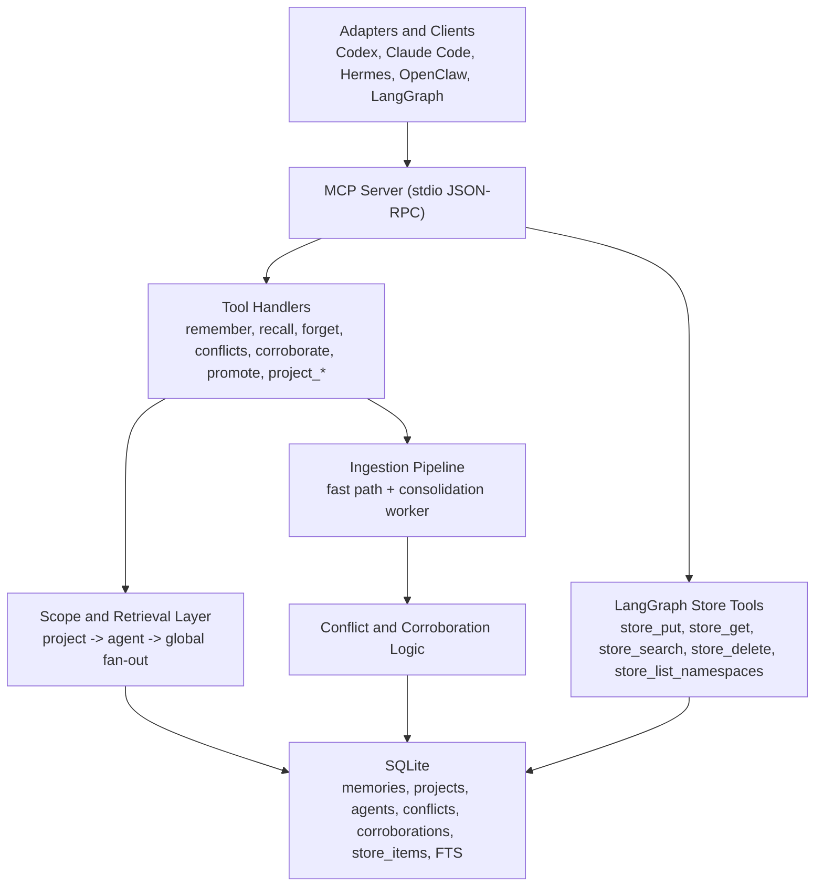

# Memryon

Memryon is a local-first, MCP-native memory operating system for multi-agent AI systems. It gives agents and orchestration frameworks a shared memory layer with three visibility scopes (`agent`, `project`, and `global`), agent provenance on every write, contradiction tracking, corroboration, and LangGraph-compatible exact store semantics on top of a single SQLite database.

## Quick Start

1. Install dependencies.

```bash
npm install
```

2. Build the TypeScript server.

```bash
npm run build
```

3. Initialize the SQLite database and schema.

```bash
node --input-type=module -e "import { getDb, closeDb } from './dist/db/connection.js'; const dbPath = process.env.MEMRYON_DB_PATH ?? 'memryon.db'; getDb(dbPath); closeDb(dbPath); console.log('Initialized ' + dbPath);"
```

4. Start the MCP server over stdio.

```bash
npm start
```

Optional: seed a local demo database with sample agents, a project, memories across all scopes, and logged conflicts.

```bash
npx tsx scripts/seed.ts
```

## Architecture



## Tool Reference

| Tool | Signature |
| --- | --- |
| `remember` | `remember(content, agent_id, user_id, scope, project_id?, framework?, session_id?, importance_hint?, content_type?, tags?)` |
| `recall` | `recall(user_id, agent_id, query?, intent_hint?, scope?, project_id?, framework_filter?, top_k?)` |
| `forget` | `forget(memcell_id, agent_id, reason?)` |
| `conflicts` | `conflicts(since?, framework?, project_id?, scope?)` |
| `corroborate` | `corroborate(memory_id, agent_id)` |
| `promote` | `promote(memory_id, agent_id, new_scope, project_id?)` |
| `project_create` | `project_create(name, description?, user_id, agent_id)` |
| `project_join` | `project_join(project_id, agent_id, role?)` |
| `project_context` | `project_context(project_id, user_id)` |

LangGraph-oriented `store_*` tools are also available in `src/mcp/tools/` and are used by the Python `memryon-langgraph` connector.

## Configuration

| Variable | Default | Purpose |
| --- | --- | --- |
| `MEMRYON_DB_PATH` | `memryon.db` | Path to the SQLite database file used by the MCP server and helper scripts. |
| `MEMRYON_EMBEDDING_MODEL_PATH` | `./models/<modelVersion>.onnx` | Overrides the ONNX model path used by `generateEmbedding`. |
| `MEMRYON_USER_ID` | `local-user` fallback | Used by consolidation when it must infer a user ID for staged candidates. |
| `MEMRYON_SERVER_COMMAND` | unset | Python connector override for the executable used to launch the Memryon MCP server. |
| `MEMRYON_SERVER_ARGS` | unset | Python connector override for server arguments as a JSON array. |
| `MEMRYON_SERVER_ENV` | unset | Python connector override for server environment variables as a JSON object. |
| `MEMRYON_AGENT_ID` | unset | Default agent ID for the Python connector. |
| `MEMRYON_PROJECT_ID` | unset | Default project scope for the Python connector. |
| `MEMRYON_SCOPE` | inferred | Explicit scope override for the Python connector. |
| `MEMRYON_SESSION_ID` | unset | Optional session identifier passed through connector operations. |

## Testing

Run the TypeScript test suite:

```bash
npm test
```

Run TypeScript type-checking:

```bash
npm run typecheck
```

Run the Python connector test suite:

```bash
cd python
python -m pytest
```
