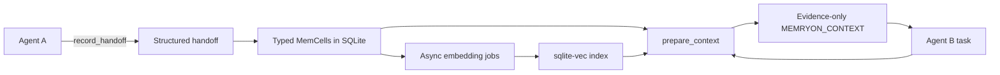

# Memryon

Memryon is a local-first shared project brain for AI agents. One agent records
a concise, structured handoff; another agent receives the relevant decisions,
constraints, failures, outcomes, and unresolved questions before starting its
task.

The MVP runs as an MCP server over stdio, stores data in SQLite, and supports
Claude Code, Codex, OpenClaw, Hermes, and LangGraph. Memories retain their
writing-agent provenance and live in `agent`, `project`, or `global` scope.

## Quick Start

From a source checkout:

```bash
npm install
npm run build
npm link
memryon init
```

`memryon init` creates `.memryon/project.json`, initializes the shared database
in the OS data directory, registers stable integration agent IDs, and downloads
the pinned embedding and reranking models. To start immediately without model
weights:

```bash
memryon init --skip-models
```

Retrieval then works in BM25-only degraded mode until `memryon models install`
completes.

Install an integration:

```bash
memryon integrate claude-code
memryon integrate codex
memryon integrate openclaw
memryon integrate hermes
```

Claude Code and OpenClaw inject context automatically. Codex gets MCP guidance
in `AGENTS.md`; tasks passed through `memryon codex "task"` are augmented before
Codex starts. Interactive Codex retrieval remains best-effort until Codex
provides a supported pre-prompt lifecycle hook.

## Core Flow


```mermaid
flowchart LR
  A["Agent A"] -->|"record_handoff"| H["Structured handoff"]
  H --> M["Typed MemCells in SQLite"]
  M --> J["Async embedding jobs"]
  J --> V["sqlite-vec index"]
  B["Agent B task"] --> P["prepare_context"]
  M --> P
  V --> P
  P --> C["Evidence-only MEMRYON_CONTEXT"]
  C --> B
```

`prepare_context` resolves visible memories, gathers BM25, vector, recent, and
graph candidates, reranks them locally, removes stale/private/superseded
content, fits the token budget, attaches unresolved conflicts, and persists the
exact context-pack audit trail.

## MCP Tools

The two primary MVP tools are:

| Tool | Purpose |
| --- | --- |
| `prepare_context` | Compile task-aware evidence with provenance, inclusion reasons, conflicts, latency, and degraded-mode status. |
| `record_handoff` | Store a concise summary and independently retrievable decisions, constraints, failures, outcomes, and unresolved questions. |

`remember` also accepts `memory_kind`, `task_id`, `metadata_json`, and
`evidence_refs`. Existing `remember`, `recall`, `forget`, `conflicts`,
`corroborate`, `promote`, `project_*`, and LangGraph `store_*` interfaces remain
available.

Raw tool output is not durable by default. Optional tool-activity capture enters
`candidate_buffer` for later review, and Memryon never asks integrations to
store hidden reasoning or chain-of-thought.

## CLI

```text
memryon init [--skip-models]
memryon serve
memryon doctor
memryon models install|status
memryon integrate claude-code|codex|openclaw|hermes
memryon context <task> [--token-budget 3000] [--top-k 12] [--json]
memryon handoff --task <task> --summary <summary> [--decision <text>]
memryon memories list
memryon conflicts
memryon export [--output backup.json]
memryon codex <task>
```

## Local Models

Model access is behind injectable `EmbeddingProvider` and `Reranker`
interfaces. Normal tests use deterministic fakes and never download weights.

| Role | Model | Revision |
| --- | --- | --- |
| Embedding | `onnx-community/all-MiniLM-L6-v2-ONNX` | `aff7a1dc4e8a1ea593e6ea21e95c22ef0a25966f` |
| Reranking | `Xenova/ms-marco-MiniLM-L-6-v2` | `a09144355adeed5f58c8ed011d209bf8ee5a1fec` |

Downloaded files are stored in the Memryon model cache. `models status`
recomputes the cache checksum and reports whether it matches the install
manifest.

## Data and Configuration

Set `MEMRYON_HOME` to override the OS data directory, `MEMRYON_DB_PATH` to
override the SQLite file, and `MEMRYON_MODEL_CACHE` to override model storage.
The default user identity is `local-user`.

The repository-level `.memryon/project.json` is the stable project identity.
SQLite uses WAL mode and numbered transactional migrations. The vector index is
a rebuildable derived cache; memories and handoff provenance remain in ordinary
SQLite tables and can be exported as JSON.

## LangGraph

The Python package in `python/` provides `MemryonStore` for
`graph.compile(store=...)` and `load_memryon_tools()` for semantic memory tools.
Long-term store semantics remain namespace/key exact; checkpoints and thread
history remain LangGraph-native.

## Verification

```bash
npm test
npm run typecheck
npm run build
python -m pytest python/tests
```

The real-model smoke test is opt-in:

```bash
MEMRYON_REAL_MODEL_TEST=1 npm test -- tests/smoke/real-model.test.ts
```

Memryon is licensed under Apache-2.0.
